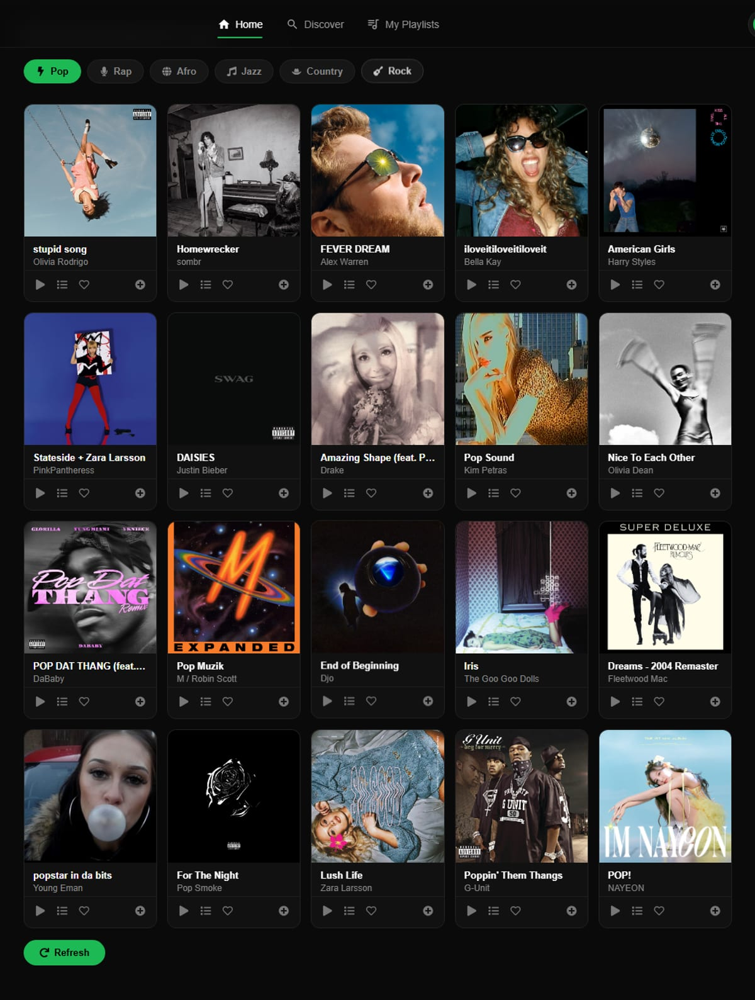

# 🎧 SignalFM — Music Discovery & Recommendation Platform

[](https://github.com/Kelyan05/SignalFM/actions/workflows/ci.yml)


**🔗 [Live demo](https://signalfm-site.onrender.com)** · **[Architecture](ARCHITECTURE.md)** · **[Design decisions & trade-offs](INTERVIEW-NOTES.md)**

> *Hosted on a free tier — the first load can take ~50 seconds while the server wakes up.*

SignalFM is a full-stack music discovery web app. It streams music through the Spotify Web Playback SDK, records each user's listening behaviour (plays, skips, likes), and uses that history to personalise a transparent, formula-based recommendation feed per genre.


<p align="center"><sub>Live per-genre recommendations, generated from the scoring formula below — try it yourself on the <a href="https://signalfm-site.onrender.com">demo</a>.</sub></p>

## The recommendation engine in one formula

Every candidate track is ranked by an explicit weighted sum — no black box, every ranking reproducible by hand:

```
score = 0.35 · popularity + 0.20 · recency + 0.45 · engagement

popularity  = Spotify popularity / 100                          → [0, 1]
recency     = linear decay, 1.0 this year → 0 at 3 years old    → [0, 1]
engagement  = clamp( (ln(likes+1)·1.0 + ln(plays+1)·0.4
                      − ln(skips+1)·1.0) / 3 , −1, 1 )          → [−1, 1]
```

Engagement carries the largest weight because it's the only *personal* signal. It's deliberately signed, so a track you keep skipping ranks **below** one you've never heard, and log-compressed and clamped so no single obsessively-replayed track can dominate. A brand-new user scores 0 on engagement, so the ranking degrades gracefully to popularity + recency — cold start falls out of the formula for free.

Every weight is a named constant with a comment justifying it in [`server/services/scoring.js`](server/services/scoring.js). The full reasoning is in [ARCHITECTURE.md](ARCHITECTURE.md).

## What it does

* **Genuinely per-user recommendations.** Interactions are written transactionally to `users/{uid}/engagement/{trackId}`, so two users browsing the same genre get different rankings from their own history.
* **Real-time feedback loop.** Recommendations are cached per user+genre (5-minute TTL) and invalidated the moment that user records a new event — a like or skip is reflected on the very next request.
* **Works without Spotify Premium.** Full in-app playback needs the Web Playback SDK (Premium-only); everyone else gets 30-second previews where Spotify provides them, or one-click open-in-Spotify links. Search, recommendations, likes, and playlists never require a Spotify connection at all.
* **Tested and gated.** The scoring module is pure (no I/O) and covered by 12 unit tests; every Express route is covered by supertest endpoint tests — 35 tests total, run by GitHub Actions on every push alongside a client lint/build gate.
* **Locked-down data access.** Firestore security rules restrict client access to the requester's own documents; the backend uses the Admin SDK for everything else.

## Architecture

* **Frontend:** React 18 + Vite, with domain-specific custom hooks (`useRecommendations`, `useTrackEvents`, `usePlaylists`) separating data access from presentation.
* **Backend:** Node.js/Express layered as routes → middleware → controllers → services. Firebase ID tokens are verified in middleware; user identity always comes from the verified JWT, never the request body.
* **Database:** Google Firestore, with transactional writes for engagement counters.
* **External APIs:** Spotify Web API (catalogue) and Web Playback SDK (in-browser streaming).
* **Deployment:** Render.

See [ARCHITECTURE.md](ARCHITECTURE.md) for the request flow and data model, and [INTERVIEW-NOTES.md](INTERVIEW-NOTES.md) for why each decision was made and what I'd change at scale.

## Running locally

```bash
git clone https://github.com/Kelyan05/SignalFM.git
cd SignalFM/client && npm install
cd ../server && npm install
```

```bash
# Terminal 1 — backend
cd server && node server.js

# Terminal 2 — frontend
cd client && npm run dev
```

```bash
# Tests
cd server && npm test
```

### Environment variables

Create `server/.env`:

```env
SPOTIFY_CLIENT_ID=your_client_id
SPOTIFY_CLIENT_SECRET=your_client_secret
SPOTIFY_REDIRECT_URI=http://127.0.0.1:3001/api/spotify/callback
FIREBASE_SERVICE_ACCOUNT=your_service_account_json
FRONTEND_URL=http://127.0.0.1:5173
```

`SPOTIFY_REDIRECT_URI` must also be registered as a redirect URI on the app in the [Spotify Developer Dashboard](https://developer.spotify.com/dashboard), or the Connect Spotify button will fail at the Spotify authorization step.

Create `client/.env` — without this, every API call (search, recommendations, Connect Spotify, shared playlists) silently targets `undefined` and fails:

```env
VITE_API_URL=http://127.0.0.1:3001
```

## Known limitations

Kept honest on purpose — these are discussed in more depth in [INTERVIEW-NOTES.md](INTERVIEW-NOTES.md):

* **In-memory caching** doesn't survive restarts and doesn't work across multiple server instances; Redis is the fix at scale.
* **No time decay on engagement** — a like from six months ago counts the same as one from today.
* **Candidate pool = genre search results**, so the engine can only rerank what Spotify search returns.
* **Spotify OAuth tokens are passed via redirect URL** during login, which exposes them to browser history; an httpOnly-cookie flow is the correct fix.
* **Access tokens aren't auto-refreshed client-side**, so in-browser playback stops ~1 hour after connecting until the user reconnects.
* Endpoint tests use an in-memory Firestore double rather than the real emulator; React hooks have no test coverage yet.

## Author

**Kelyan Djomo** — [GitHub](https://github.com/Kelyan05) · [LinkedIn](https://linkedin.com/in/kelyan-djomo) · darrelkelyan@outlook.com

## License

MIT
